# Example - ERC20 Token

The ERC-20 token standard is a widespread and respected protocol in the cryptocurrency space. It provides a set of rules and functionalities for issuing tokens on the Ethereum blockchain, as well as all EVM blockchains. In the context of the Lemon Chain blockchain, this standard is crucial for ensuring compatibility and interoperability with a broad range of decentralized applications (dApps) and services within the Ethereum/EVM ecosystem.

# Creating Your Own ERC-20 Token

In this tutorial, we'll guide you through the process of creating a standard ERC-20 Token on the Lemon Chain testnet(Citron Chain). Should you wish to deploy your smart contract on the Lemon Chain mainnet, simply follow the same procedure, ensuring to select the Lemon Chain mainnet network instead of the testnet network. 

## Requirements

- A modern web browser (e.g., Chrome) 
- Testnet LEMX for gas expenses 
- A crypto browser wallet

## 1. Add Lemon Chain Testnet to your browser wallet

Copy the following values in your browser wallet to connect to the Lemon Chain Testnet:

| Property           | Value                                   |
|--------------------|-----------------------------------------|
| Network name       | `Citron Chain`                         |
| RPC URL            | `https://rpc.testnet.lemonchain.io/`    |
| Chain ID           | `1005`                                  |
| Currency Symbol    | `tLEMX`                                  |

This is what it should look like:

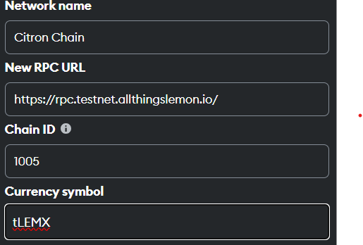

## 2. Get testnet tLEMX

Visit the [Lemon Chain Testnet Faucet](http://example.com) to request tLEMX (testnet LEMX) tokens.

## 3. Visit OpenZeppelin Contracts Wizard

You can visit the [OpenZeppelin Contracts Wizard](https://wizard.openzeppelin.com/) as an easy way to generate the contract for your ERC-20 Token.

## 4. Set characteristics of your ERC20

Go through the fields and set the parameters as you like:

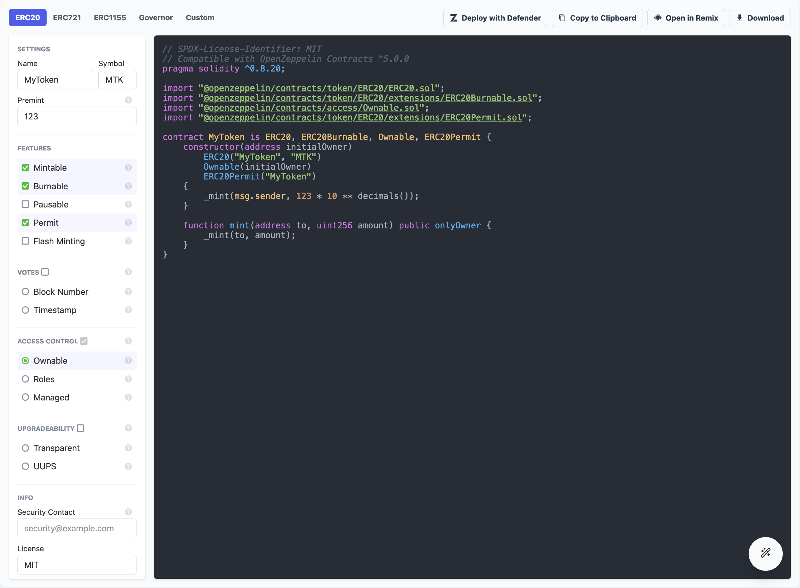

## 5. Using RemixIDE

Once you have set the characteristics above, click "Open in Remix" in the top right corner.

This is what the Remix IDE interface looks like:

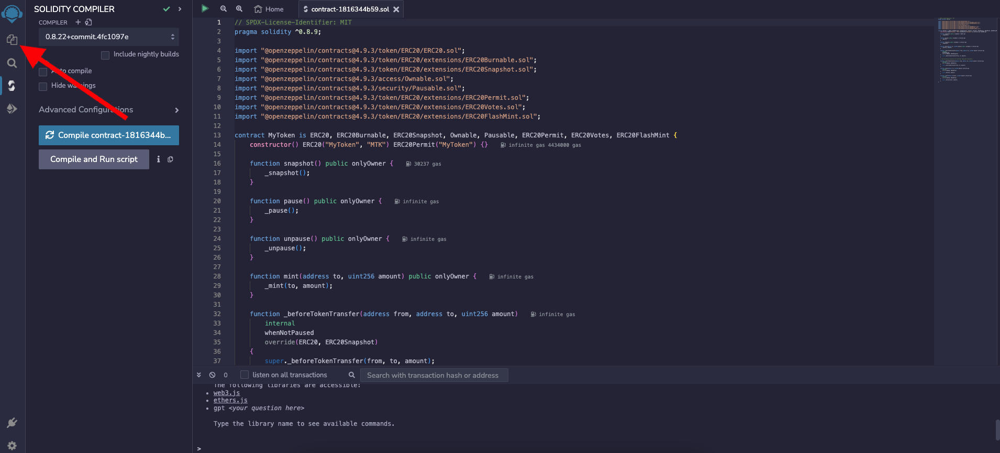

On the left sidebar click on the "Files" tab to open the File Explorer pane.

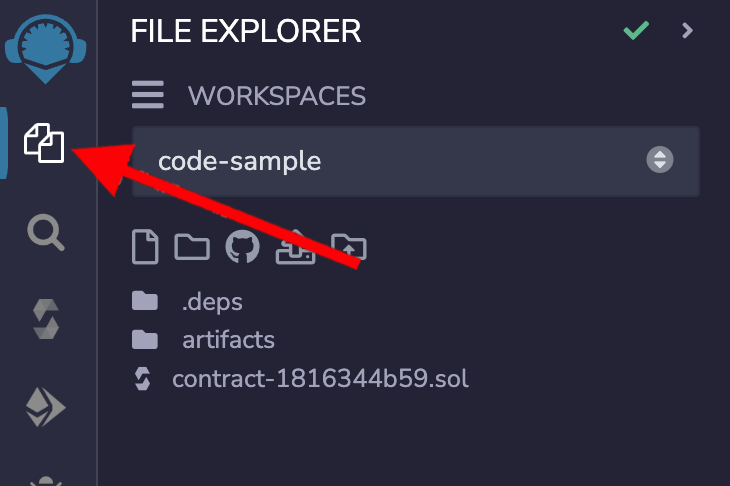

Here you can see some already existing files and directories.

Right click on your contract (that was created using the wizard earlier), click rename, and pick a name that is more memorable. 

In this example, we're changing the name from "contract-1816344b59.sol" to "my_token.sol":

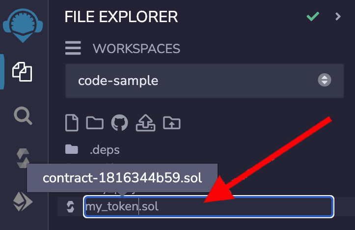
:::danger
Make sure to keep the `.sol` extension, otherwise, this won't work.
:::

## 6. Compiling the smart contract

After everything above is done, on the left sidebar click on the "Solidity compiler" tab:

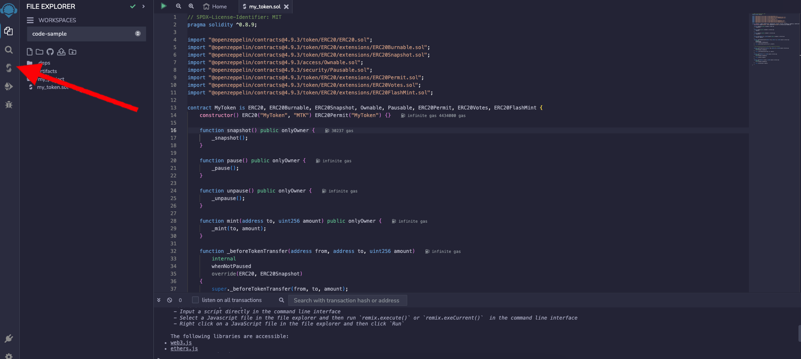

It is also important to note that when deploying on Lemon Chain, it's crucial to set the EVM version to london. 

To do that click on **"Advanced Configuration"**, and then under the **"EVM Version"** dropdown menu, select **"london"**:

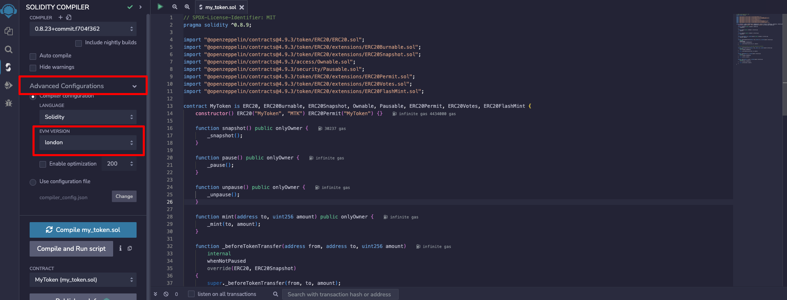

:::danger
When using a Solidity compiler version above 0.8.19, ensure the EVM version is set to London to avoid errors. 

For optimal results and compatibility, use the latest compiler version, currently 0.8.23, with the London EVM setting.
:::

:::info
Versions starting from 0.8.20 use the PUSH0(0x5f) opcode, which is not compatible with chains other than Ethereum mainnet. 
:::

Check the compiler version and the selected contract. 

The compiler version should be at least 0.8.9 because of the line `pragma solidity ^0.8.9;` in the smart contract.

Then, click the Compile my_token.sol button. If everything goes well, you will see a green check mark on the Compile button:

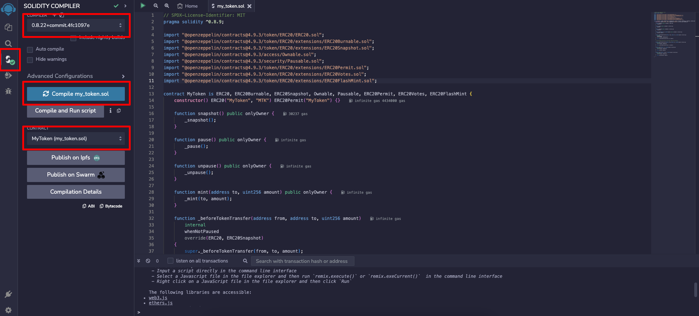

## 7. Deploying the smart contract

Then, click on the "Deploy & run transactions" button on the left sidebar:

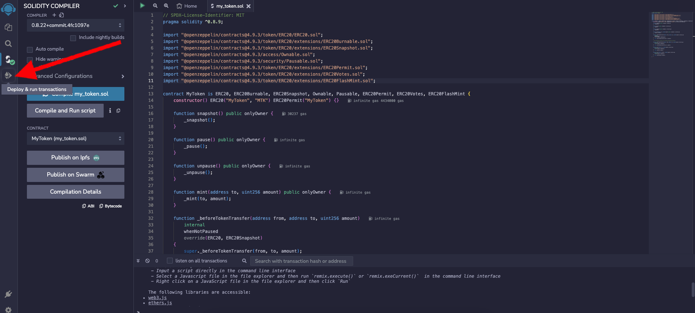

Here, there are 3 important fields:

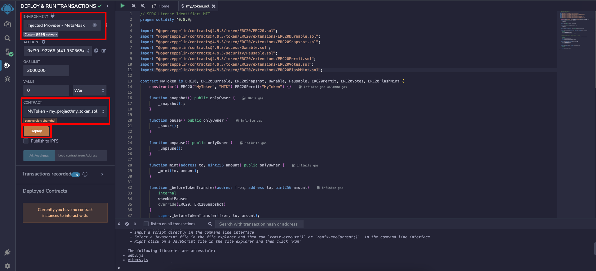

Choose "Injected Provider" under the "Environment" field.

If you have correctly added Lemon Chain Testnet to your browser wallet as outlined in [Step 1](/docs/Developers/Smart%20Contracts/Deploying%20Smart%20Contracts/erc20#1-add-Lemon Chain-testnet-to-your-browser-wallet), you should see "Custom (8194) network" as shown here:

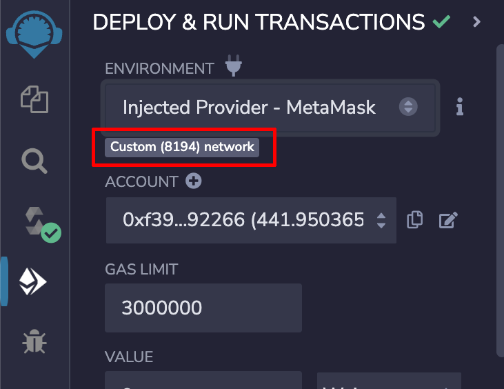

Then make sure the contract selected is correct.

If you have renamed the contract and followed all the other steps in this guide, you should see this directory:

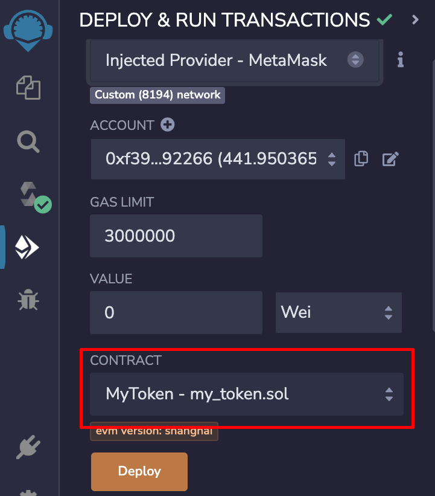

After you have completed the above steps, click "Deploy" and confirm the transaction in your browser wallet:

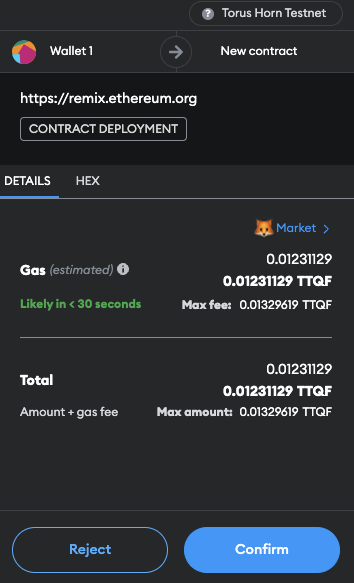

That’s it! Your token contract is now deployed on Lemon Chain's Horn testnet!

If you would like to deploy this contract on Lemon Chain mainnet, repeat all the steps outlined above, but using the Lemon Chain mainnet in your browser wallet.

