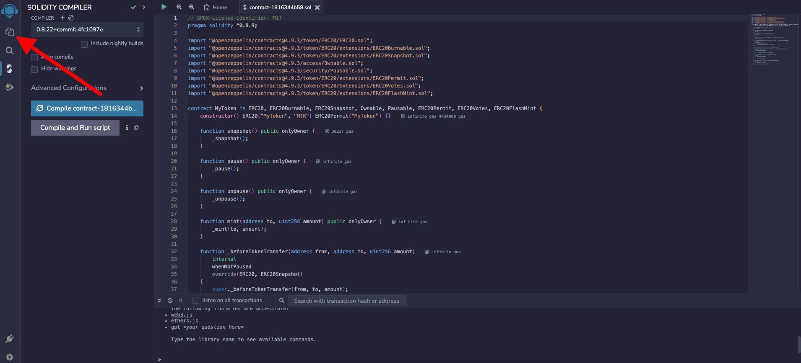
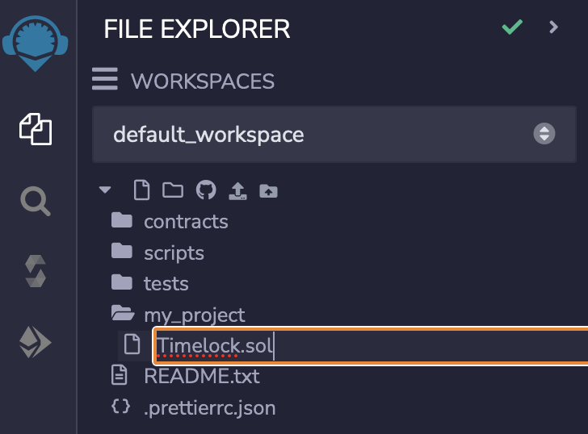

# Example - Timelock Smart Contract

## Add Lemon Chain Testnet on your browser wallet

Copy the following values in your browser wallet to connect to the Citron Chain:

| Property           | Value                                   |
|--------------------|-----------------------------------------|
| Network name       | `Citron Chain`                         |
| RPC URL            | `https://rpc.testnet.lemonchain.io`    |
| Chain ID           | `1005`                                  |
| Currency Symbol    | `tLEMX`                                  |

This is what it should look like:

## Get testnet funds

Visit the [Citron Chain Faucet](http://example.com) to request tLEMX (testnet LEMX) funds.

## Use RemixIDE

Visit [Remix IDE](https://remix.ethereum.org/)

This is what the Remix IDE interface looks like:

On the left sidebar click on the "Files" tab to open the File Explorer pane.

On the File Explorer pane you can see some already existing files and directories.

Click the "Create new folder" button and give your new folder a name.

The "open folder" icon denotes that this folder is currently open.

Click on the "Create new file" button to create a new file in the currently open folder and name your new smart contract file.  

The new smart contract would be written in solidity language so give the file name the `.sol` extension.

Begin by denoting the license of your code. In this example we use the GPL-3.0 license.

Now add the solidity compiler requirements. In this example we specify version 0.8.21.

Define the contract with the name Timelock

The contract needs to store the address of the owner and a timestamp after which the withdrawal functionality is unlocked.

Define two immutable variables. One for the owner address and another for the unlock time.

Write the constructor function that instanciates the contract with the deployer's address as the owner and days to unlock as a constructor argument.

Create the withdraw function that can only be called after the unlock time has passed. Add require statements to check if the caller is the owner and if current timestamp is greater than unlock time.

Add the withdrawal logic

