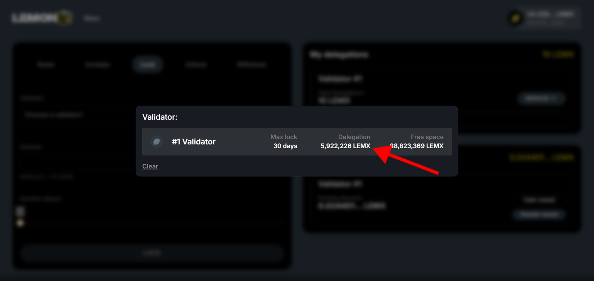

# Locking

Navigate to [stake.lemonchain.io/?tab=lock](https://stake.lemonchain.io/?tab=lock). Once you're there, follow the steps below to lock your staked LEMX.

:::danger important

If you want to modify your locked stake (increase amount or duration), the whole amount will be locked again at least for the previous duration as the staking smart contract stores the lockup duration. 
If its set date is after the validator initial lockup end, you cannot increase your lock.

:::

# Step 1

**Choosing your delegation**

1. Make sure you are on the "Lock" tab
2. Click "Choose a validator"

# Step 2
**Choosing your delegation's validator**

Choose the validator you want to lock your LEMX in (if you staked to multiple validators, you would have multiple options here).

# Step 3
**Choosing amount & lockup period**

:::info info

**Minimum lock-up period:** 12 days, earning the minimum reward rate   

**Maximum lock-up period:** 1095 days, earning the maximum reward rate   

:::

:::danger important
Please note that the specified minimum and maximum lock-up periods are determined by the network. The maximum lock-up period is contingent on the validator you choose to stake with. For instance, if your selected validator has a lock-up period of 60 days, this duration becomes the maximum lock-up period for you as a delegator as well.
:::

1. Enter the quantity of LEMX you wish to lock in the "Amount" field.
2. Select the duration for which you wish to lock in your LEMX.

# Step 3.1 

**Increasing locked amount and relock**

1. Adjust the slider or manually enter the desired amount of additional LEMX you wish to lock.
2. Observe the updated staking details reflecting the additional locked LEMX.
3. Click on "Increase Locked Amount and Lock Duration" to finalize.

:::info 

Note that the button displays "Increase Locked Amount and Lock Duration" with a minimum duration of 20 days. This is because, in our example with Validator #1, there's an existing locked stake. The system requires that any additional lock cannot have a duration shorter than any existing lock on the same validator using the same wallet. Therefore, if you're adding to a 20-day lock to Validator #1, any further lock to this validator from the same wallet must also be for at least 20 days.

:::

:::danger important

Please note that your current locked stake will also be locked for the current duration (the lockup end date will be modified).  
If you want to increase the locked amount, the validator lockup end has to be later than your new lockup end.

:::

# Step 3.2 

**Increasing lock duration**

1. Adjust the slider to select the additional lock duration you want.
2. Observe the updated staking details reflecting the additional lock duration.
3. Click on "Increase Lock Duration" to finalize.

# Step 3.3

**Increasing locked amount and lock duration**

1. Adjust the slider or manually enter the desired amount of additional LEMX you wish to lock.
2. Adjust the slider to select the additional lock duration you want.
2. Observe the updated staking details reflecting the additional locked LEMX and updated lock duration.
3. Click on "Increase Locked Amount and Lock Duration" to finalize.

# Step 4 

**LEMX is locked**

Great job! Your LEMX is successfully locked. You can always check your locked delegations on the staking dashboard, indicated by the red arrow in the image below. This dashboard also shows the percentage of the total stake that's locked and the lockup period's end date. If you've staked with multiple validators, your delegations to each will be displayed here too.

