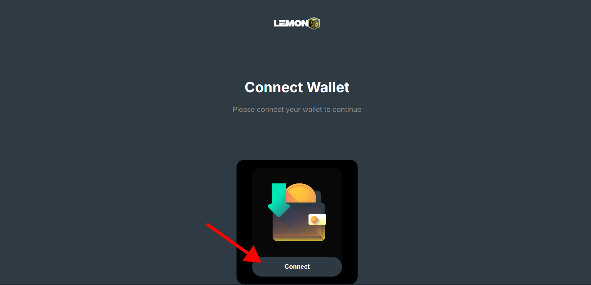
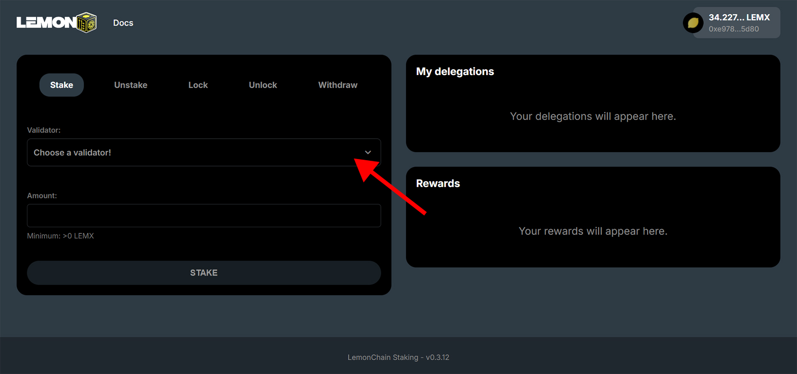
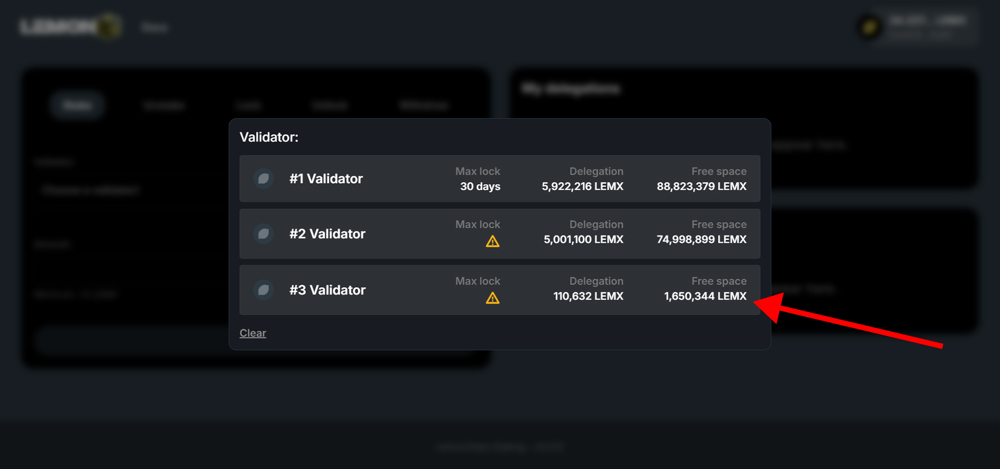
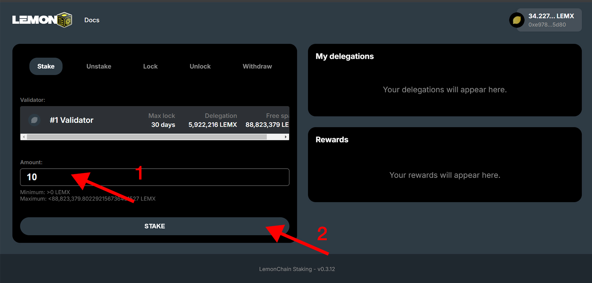
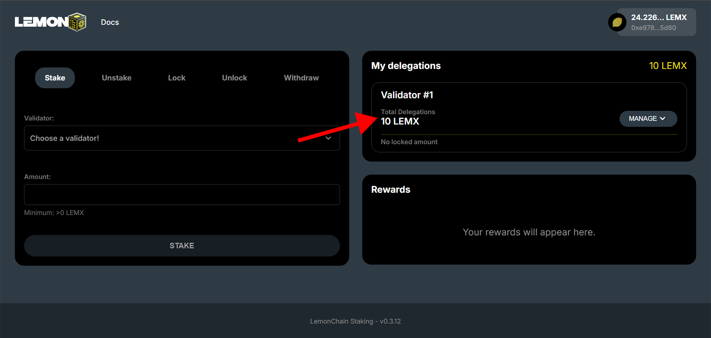

# Staking

To stake your LEMX, please refer to the detailed guide below. For those new to staking or seeking additional information, click [here](/docs/learn/what-is-staking) to learn more.

# Step 1
**Connecting your wallet**

Navigate to [stake.lemonchain.io](https://stake.lemonchain.io/). Once you're there, click on "Connect Wallet"

# Step 2
**Staking dashboard**

You are now logged into the staking dashboard with your wallet. Click "Choose a validator".

# Step 3
**Choosing your validator**

:::danger Keep in mind

We strongly recommend careful selection of your validator, taking into account their uptime, industry experience, and community engagement, as these elements are crucial in influencing your decision. 

Additionally, be aware that if a validator acts inappropriately and faces penalties (slashed), their entire stake, including yours, will be lost. You can read more about this [here](/docs/Roles/Validator/specifications#slashing).

:::

On the staking dashboard, each validator displays the maximum lock-up time for your LEMX, their total stake (minimum of 350,000 LEMX plus delegations), and available space (15 times the total stake).

# Step 4
**Staking**

After selecting your preferred validator, follow these steps:

1. Enter the desired amount of LEMX in the "Amount" field.
2. Click "Stake" and confirm the transaction to complete the process.

# Step 5
**LEMX is staked**

Congratulations! Your LEMX is now staked. At any time, you can visit the staking dashboard, and view your delegations as pointed in the red arrow below. If you have staked to multiple different validators, your delegations to them will be displayed here as well.

