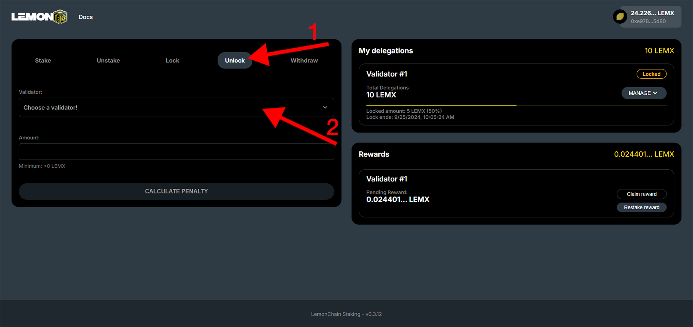
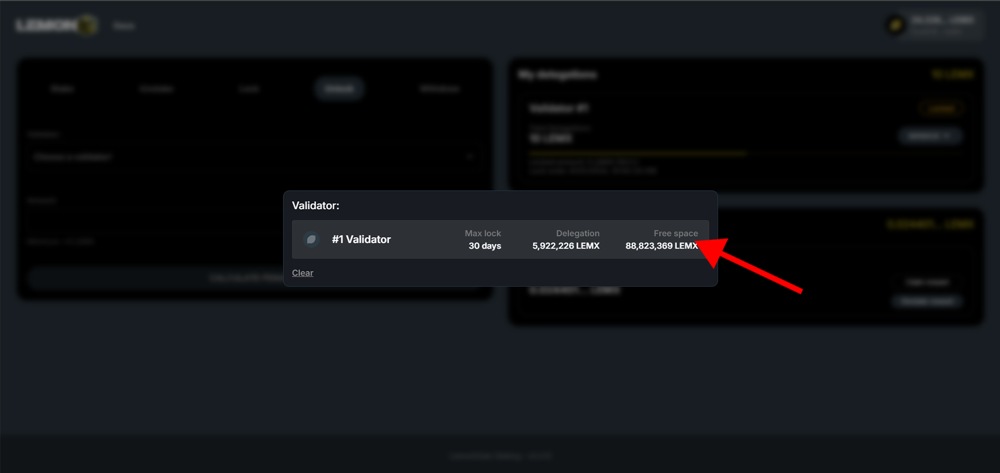
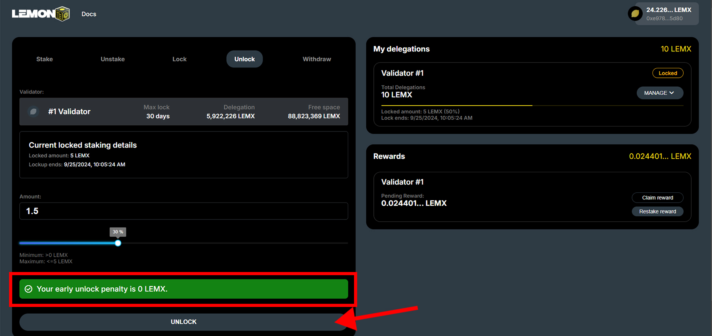
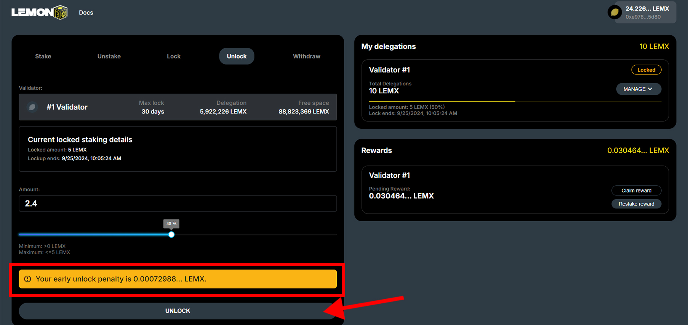

# Unlocking

Navigate to [stake.lemonchain.io/?tab=unlock](https://stake.lemonchain.io/?tab=unlock). Once you're there, follow the steps below to unlock your LEMX.

# Step 1
**Choosing your delegation**

1. Make sure you are on the "Unlock" tab
2. Click "Choose a validator"

# Step 2
**Choosing your delegation's validator**

Choose the validator you want to unlock your LEMX from (if you staked to multiple validators, you would have multiple options here).

# Step 3
**Calculating early unlock penalty**

If you choose to unlock your LEMX before the assigned lockup period, you have this option. However, you will incur a penalty equal to half the rewards accrued. You can read more about this [here](/docs/Roles/Delegator/specifications#locking).

Prior to proceeding with the token unlock, it's necessary to calculate any applicable penalty.

1. Enter the quantity of LEMX you wish to unlock in the "Amount" field.
2. Click "Calculate Penalty".

# Step 3.1 
**No early unlock penalty**

In the case you decide to unlock in the same epoch you locked your LEMX, you will incur no penalty on your rewards.

1. Enter the quantity of LEMX you wish to unlock in the "Amount" field.
2. Click "Unlock".

# Step 3.2
**Early unlock penalty**

In the case you decide to unlock after an epoch has passed since locking your LEMX, you will incur a penalty on your rewards.

1. Enter the quantity of LEMX you wish to unlock in the "Amount" field.
2. Click "Unlock".

