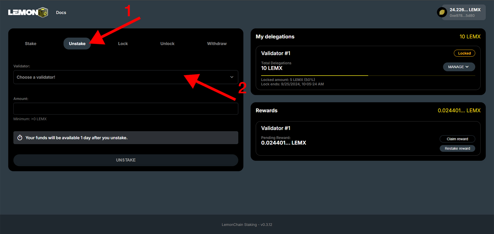
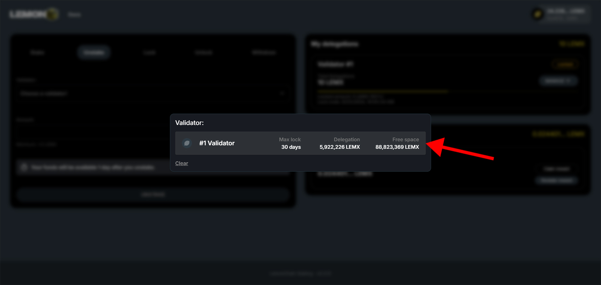
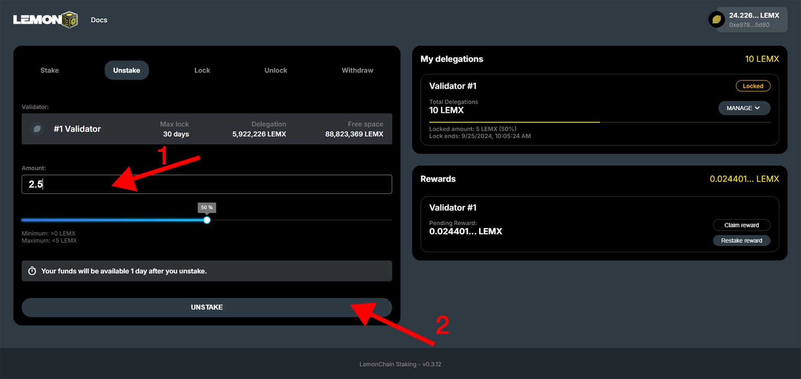

# Unstaking

Navigate to [stake.lemonchain.io/?tab=unstake](https://stake.lemonchain.io/?tab=unstake). Once you're there, follow the steps below to unstake your LEMX.

# Step 1
**Choosing your delegation**

1. Make sure you are on the "Unstake" tab
2. Click "Choose a validator"

# Step 2
**Choosing your delegation's validator**

Choose the validator you want to unstake your LEMX from (if you staked to multiple validators, you would have multiple options here).

# Step 3
**Unstaking**

:::danger Keep in mind

When unstaking, your LEMX will only be available to you after a 7 day unbonding period. You can read more about this [here](/docs/Roles/Delegator/specifications#unbonding-period).

:::

1. Enter the quantity of LEMX you wish to unstake in the "Amount" field.
2. Click "Unstake" and confirm the transaction to complete the process.

