# Run a validator node

## Requirements

- Minimum stake 250 LEMX
- Minimum hardware requirements: AWS EC2 m5.xlarge with 4 vCPUs (3.1 GHz) and at least 1 TB of Amazon EBS General Purpose SSD (gp2) storage (or equivalent).

## Procedure overview

- [Run a validator node](#run-a-validator-node)
  - [Requirements](#requirements)
  - [Procedure overview](#procedure-overview)
  - [Launch Cloud Instance](#launch-cloud-instance)
    - [Node Specifications](#node-specifications)
    - [Storage](#storage)
    - [Network Settings](#network-settings)
  - [Set up Non-Root User](#set-up-non-root-user)
  - [Connect using the non-root user](#connect-using-the-non-root-user)
  - [Install Required Tools](#install-required-tools)
    - [Install Go](#install-go)
    - [Install Opera](#install-opera)
  - [Register Lemon Validator](#register-lemon-validator)
    - [Create a validator wallet](#create-a-validator-wallet)
    - [Create a validator key](#create-a-validator-key)
    - [Fund your validator wallet](#fund-your-validator-wallet)
    - [Create your validator](#create-your-validator)
      - [Method 1: Create Validator using Lemon Staking Dashboard](#method-1-create-validator-using-lemon-staking-dashboard)
      - [Method 2: Create Validator using opera console](#method-2-create-validator-using-opera-console)
  - [Run your Lemon Validator Node](#run-your-lemon-validator-node)
  - [Enable metrics for your node (optional)](#enable-metrics-for-your-node-optional)

## Launch Cloud Instance

When setting up a validator node, you have two options:

- running it on your own hardware
- utilizing a cloud provider's services

Amazon AWS is a popular choice among the big cloud providers. However, if you prefer to maintain full control over your hardware and infrastructure, running the node on your own equipment might be a suitable alternative.

### Node Specifications

We recommend the following or better:
m5.xlarge **General Purpose Instance** with 4 vCPUs (3.1 GHz), 16GB of memory, up to 10 Gbps network bandwidth and at least **1TB** of disk space. AWS mm6i.2xlarge, c61.4xlarge can provide better performance. Bare metal with equivalent or higher specs are even better.

We would recommend going with Ubuntu Server 22.04 LTS (64-bit).

### Storage

**1 TB** is sufficient for running during the first year of the blockchain.
_In the future, we will supply a no-history genesis in snapsync mode to make running the node using similar storage requirements even when running the node after the first year of the blockchain._
**2 TB** is sufficient if you're running using a pruned datadir.
**9 TB** is needed if you'd like to run with a full size (non-pruned) datadir

### Network Settings

Open up port 22 (TCP) for SSH and port 5050 (TCP and UDP) for peer communication and discovery.  
A custom port can be used with `--port <custom>` flag when running your opera node instead of the default port 5050.

## Set up Non-Root User

If there is already a non-root user available, you can skip this step.

SSH into your machine

```console
$ ssh root@{SERVER_IP_ADDRESS}
```

Update the system

```console
# apt update && apt upgrade -y

```

Install needed tools

```console
# apt install -y bash sudo

```

Set bash as the default shell

```console
# chsh -s /bin/bash

```

Use bash shell

```console
# bash

```

Create a non-root user

```console
# USER={YOUR_DESIRED_USERNAME}
# useradd -m -d /home/$USER -s /bin/bash -c $USER -p '' $USER
# usermod -aG sudo $USER
# mkdir -p /home/$USER/.ssh
# touch /home/$USER/.ssh/authorized_keys
# chown -R $USER:$USER /home/$USER/
# chmod 700 /home/$USER/.ssh
# chmod 644 /home/$USER/.ssh/authorized_keys

```

Create a new password for the user

```console
# passwd $USER

```

Make sure to paste your public SSH key into the **authorized_keys** file of the newly created user in order to be able to log in via SSH.

```console
# vi /home/$USER/.ssh/authorized_keys

```

Enable sudo without password for the user

```console
# visudo /etc/sudoers

```

Add the following line to the end of the file:

```text
{YOUR_USERNAME} ALL=NOPASSWD: ALL
```

## Connect using the non-root user

Close the root SSH connection to the machine

```console
# exit

```

Log in again as your newly created user:

```shell
ssh {YOUR_USERNAME}@{SERVER_IP_ADDRESS}
```

## Install Required Tools

While still logged in via SSH as the newly created user, you will need to install **Go** and **Opera**.

First, you need to install the required build tools:

```shell
sudo apt install -y build-essential nano

```

### Install Go

```shell
wget https://go.dev/dl/go1.21.6.linux-amd64.tar.gz
sudo tar -xvf go1.21.6.linux-amd64.tar.gz
sudo mv go /usr/local

```

Export the required Go paths:

```shell
vi ~/.bash_aliases

```

Append the following lines:

```shell
export GOROOT=/usr/local/go
export GOPATH=$HOME/go
export PATH=$GOPATH/bin:$GOROOT/bin:$PATH
```

Set the required environment variables (so that the changes are taken into account without the need to reboot the server):

```shell
source ~/.bash_aliases

```

Validate your Go installation

```shell
go version

```

If everything went well you should see something like this as the output

```shell
go version go1.21.6 linux/amd64
```

The version shown should match the version installed

### Install Opera

```shell
git clone https://github.com/Fantom-foundation/go-opera.git
cd go-opera/
git checkout release/1.1.3-rc.5
make

```

Validate your **Opera** installation:

```shell
./build/opera version

```

If everything went well, you should see something like this in the output:

```shell
Version: v1.1.3-rc.5
```

It is recommended to use `--db.preset=ldb-1` for starting opera command for a validator node.

## Register Lemon Validator

After installing everything we need, you can continue by registering your Lemon validator node on-chain. To do this, you need to create a validator wallet. The wallet is the validator’s identity in the network which it uses to authenticate, sign messages, etc.

First, start the **Opera** read-only node to interact with it and to create a validator wallet:

```shell
cd ~/go-opera/build/
wget https://docs.lemonchain.io/genesis-files/mainnet/genesis-lemon.g
./opera --genesis genesis-lemon.g --genesis.allowExperimental --db.preset=ldb-1 --syncmode full --bootnodes "enode://2c4dbe91211158e21052f0edd082ade3a8b0a49a98fe71e07674a5e3b21a4b18be9b27763680b5df999b06a46788f163bc0fe720428e039a8c808914bc1912eb@51.20.98.124:5050,enode://6add2faf1cdf3349df9c520ef51afc14c29d4e56bbc9cd27c01b82d03fa6cf7a421041f0fe1129e249096ce61798bd90332f29a57b7c53e21c4f43f5d0fa7357@54.183.88.44:5050
citron_bootnodes=enode://cf98054d43e5999a4cbb19db97325a95d08cae1496c44f25a537f48cfc98cf777dab60936cd631baf85e31cdf358689e7594e045658210ca075838ab9c17b1ad@54.246.247.129:5050,enode://8d84391799b50c0a632d90a49ed08b481b6a6af4609c52603908d4919a37da41123225407629f8142cf8eba0d30d6bc0865bd11d9d0a9d5bb73c5ac7fdc8b226@184.72.141.186:5050"

```

_Note that `--http` and `--ws` must **not** be enabled on a server that stores wallet accounts._

Starting up your node will look something like this:

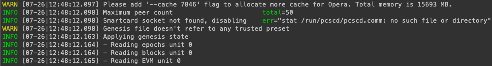

The node should start to sync the network data:

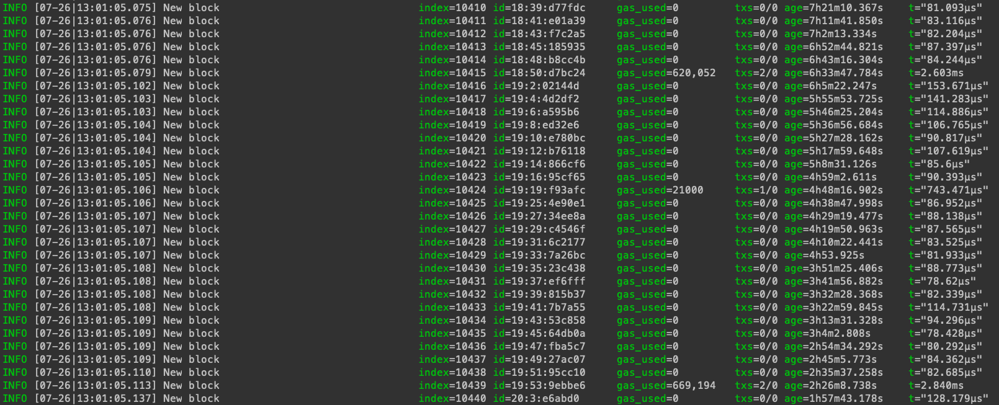

Once it's run, you should wait till it's synced up to the latest block before proceeding to the next step.

### Create a validator wallet

The node running and syncing the network in your current console, so you need to open up a new console window, connect via SSH to the server and enter the following commands to create a wallet:

```shell
./opera account new

```

After entering the command, you will get prompted to enter a password for the account/wallet.  
Use a strong one! You can e.g. use a password manager to generate a 20+ digit password to secure your wallet.

It will look something like this:

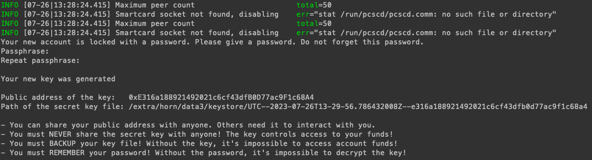

:::danger

NEVER share your private key or keystore with anyone!

:::

_**By the way:** The wallet above is not a real wallet we use, it's just for demonstration purposes only._

:::info

Make a note of the **Public address**. You will need it to register your validator node.

:::

### Create a validator key

After creating your validator wallet, you now need to create a validator key.

Enter the following command to create a validator key:

```shell
./opera validator new

```

After entering the command, you will get prompted to enter a password for the validator key.  
Use a strong one!

It will look something like this:

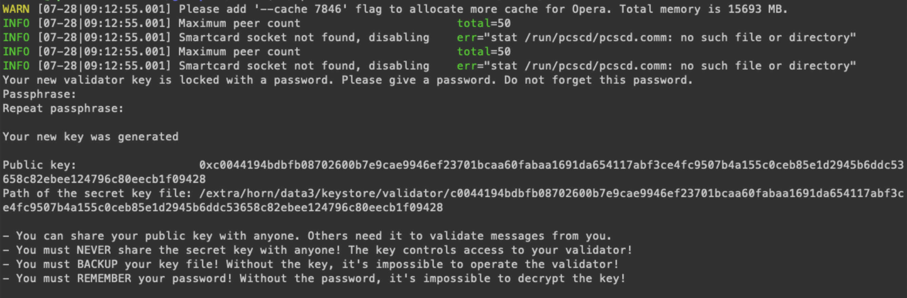

You can make a password file to avoid entering the password on the command line every time you start opera.

Create and edit the password file named `validator-key-password`. Type the validator key password in the file and finally save the file:

```shell
vi ~/validator-key-password

```

Make the password file only readable by your user:

```shell
chmod 400 ~/validator-key-password

```

:::info

Make a note of your **public key**. You will need it to register your validator node.

:::

### Fund your validator wallet

The next step is to fund your validator wallet with enough LEMX to become a validator. That means you need to have at least 250 LEMX, or the current minimum, in the wallet you just created (send a little more to cover transaction fees).

Make sure you wait for your node to be fully synced, otherwise your LEMX will not show up in your wallet!

### Create your validator

You should wait for your node to sync to the latest block of the network before proceeding.

To create your validator, you need to either interact with the SFC using the opera console or take the much easier way
by visiting the Lemon Staking Dashboard.

#### Method 1: Create Validator using Lemon Staking Dashboard

Navigate to [stake.lemonchain.io](https://stake.lemonchain.io/). Once you're there, connect your wallet.

If your wallet contains the required amount of LEMX, you can see the Validator menu item. Select it.

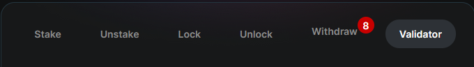

Fill the form with your validator public key and the staking amount. The staking amount has to be more than 350.000 LEMX.

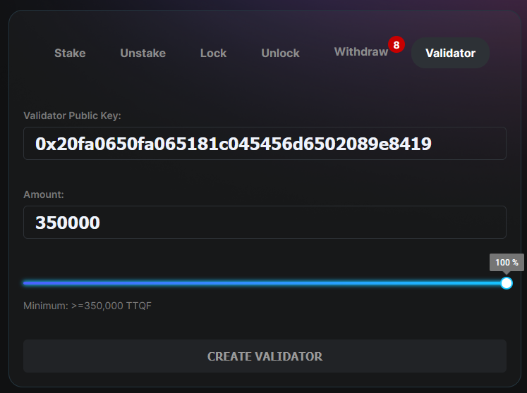

:::info

Your **public key** is **not** your wallet address, you have to create that at the
[Create a validator wallet](#create-a-validator-wallet) section.

:::

#### Method 2: Create Validator using opera console

:::warning

Make sure that your node is synced to the latest block of the network before proceeding.

:::

To proceed, open up the console where you entered the commands to create the validator wallet previously and attach to the Opera node console:

```shell
./opera attach

```

By doing so, you will get a JavaScript console where you can directly interact with the Opera node and e.g. send transactions (which you will do in a moment):

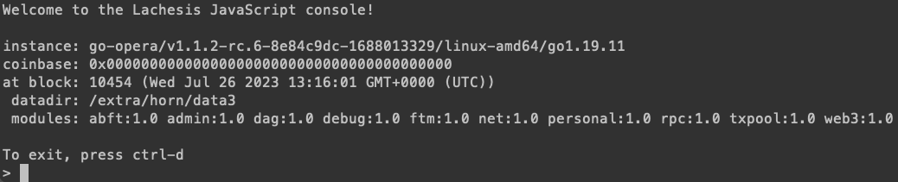

Now initialize the SFC contract ABI variable ([https://raw.githubusercontent.com/Fantom-foundation/lachesis_launch/master/releases/sfc-abi-3.0.4-rc.5.json](https://raw.githubusercontent.com/Fantom-foundation/lachesis_launch/master/releases/sfc-abi-3.0.4-rc.5.json)):

```javascript
abi = JSON.parse('[{"constant":true,"inputs":[],"name":"currentSealedEpoch","outputs":[{"internalType":"uint256","name":"","type":"uint256"}],"payable":false,"stateMutability":"view","type":"function"},{"constant":true,"inputs":[{"internalType":"uint256","name":"","type":"uint256"}],"name":"getEpochSnapshot","outputs":[{"internalType":"uint256","name":"endTime","type":"uint256"},{"internalType":"uint256","name":"epochFee","type":"uint256"},{"internalType":"uint256","name":"totalBaseRewardWeight","type":"uint256"},{"internalType":"uint256","name":"totalTxRewardWeight","type":"uint256"},{"internalType":"uint256","name":"_baseRewardPerSecond","type":"uint256"},{"internalType":"uint256","name":"totalStake","type":"uint256"},{"internalType":"uint256","name":"totalSupply","type":"uint256"}],"payable":false,"stateMutability":"view","type":"function"},{"constant":true,"inputs":[{"internalType":"address","name":"","type":"address"},{"internalType":"uint256","name":"","type":"uint256"}],"name":"getLockupInfo","outputs":[{"internalType":"uint256","name":"lockedStake","type":"uint256"},{"internalType":"uint256","name":"fromEpoch","type":"uint256"},{"internalType":"uint256","name":"endTime","type":"uint256"},{"internalType":"uint256","name":"duration","type":"uint256"}],"payable":false,"stateMutability":"view","type":"function"},{"constant":true,"inputs":[{"internalType":"address","name":"","type":"address"},{"internalType":"uint256","name":"","type":"uint256"}],"name":"getStake","outputs":[{"internalType":"uint256","name":"","type":"uint256"}],"payable":false,"stateMutability":"view","type":"function"},{"constant":true,"inputs":[{"internalType":"address","name":"","type":"address"},{"internalType":"uint256","name":"","type":"uint256"}],"name":"getStashedLockupRewards","outputs":[{"internalType":"uint256","name":"lockupExtraReward","type":"uint256"},{"internalType":"uint256","name":"lockupBaseReward","type":"uint256"},{"internalType":"uint256","name":"unlockedReward","type":"uint256"}],"payable":false,"stateMutability":"view","type":"function"},{"constant":true,"inputs":[{"internalType":"uint256","name":"","type":"uint256"}],"name":"getValidator","outputs":[{"internalType":"uint256","name":"status","type":"uint256"},{"internalType":"uint256","name":"deactivatedTime","type":"uint256"},{"internalType":"uint256","name":"deactivatedEpoch","type":"uint256"},{"internalType":"uint256","name":"receivedStake","type":"uint256"},{"internalType":"uint256","name":"createdEpoch","type":"uint256"},{"internalType":"uint256","name":"createdTime","type":"uint256"},{"internalType":"address","name":"auth","type":"address"}],"payable":false,"stateMutability":"view","type":"function"},{"constant":true,"inputs":[{"internalType":"address","name":"","type":"address"}],"name":"getValidatorID","outputs":[{"internalType":"uint256","name":"","type":"uint256"}],"payable":false,"stateMutability":"view","type":"function"},{"constant":true,"inputs":[{"internalType":"uint256","name":"","type":"uint256"}],"name":"getValidatorPubkey","outputs":[{"internalType":"bytes","name":"","type":"bytes"}],"payable":false,"stateMutability":"view","type":"function"},{"constant":true,"inputs":[{"internalType":"address","name":"","type":"address"},{"internalType":"uint256","name":"","type":"uint256"},{"internalType":"uint256","name":"","type":"uint256"}],"name":"getWithdrawalRequest","outputs":[{"internalType":"uint256","name":"epoch","type":"uint256"},{"internalType":"uint256","name":"time","type":"uint256"},{"internalType":"uint256","name":"amount","type":"uint256"}],"payable":false,"stateMutability":"view","type":"function"},{"constant":true,"inputs":[],"name":"isOwner","outputs":[{"internalType":"bool","name":"","type":"bool"}],"payable":false,"stateMutability":"view","type":"function"},{"constant":true,"inputs":[],"name":"lastValidatorID","outputs":[{"internalType":"uint256","name":"","type":"uint256"}],"payable":false,"stateMutability":"view","type":"function"},{"constant":true,"inputs":[],"name":"minGasPrice","outputs":[{"internalType":"uint256","name":"","type":"uint256"}],"payable":false,"stateMutability":"view","type":"function"},{"constant":true,"inputs":[],"name":"owner","outputs":[{"internalType":"address","name":"","type":"address"}],"payable":false,"stateMutability":"view","type":"function"},{"constant":false,"inputs":[],"name":"renounceOwnership","outputs":[],"payable":false,"stateMutability":"nonpayable","type":"function"},{"constant":true,"inputs":[{"internalType":"uint256","name":"","type":"uint256"}],"name":"slashingRefundRatio","outputs":[{"internalType":"uint256","name":"","type":"uint256"}],"payable":false,"stateMutability":"view","type":"function"},{"constant":true,"inputs":[],"name":"stakeTokenizerAddress","outputs":[{"internalType":"address","name":"","type":"address"}],"payable":false,"stateMutability":"view","type":"function"},{"constant":true,"inputs":[{"internalType":"address","name":"","type":"address"},{"internalType":"uint256","name":"","type":"uint256"}],"name":"stashedRewardsUntilEpoch","outputs":[{"internalType":"uint256","name":"","type":"uint256"}],"payable":false,"stateMutability":"view","type":"function"},{"constant":true,"inputs":[],"name":"totalActiveStake","outputs":[{"internalType":"uint256","name":"","type":"uint256"}],"payable":false,"stateMutability":"view","type":"function"},{"constant":true,"inputs":[],"name":"totalSlashedStake","outputs":[{"internalType":"uint256","name":"","type":"uint256"}],"payable":false,"stateMutability":"view","type":"function"},{"constant":true,"inputs":[],"name":"totalStake","outputs":[{"internalType":"uint256","name":"","type":"uint256"}],"payable":false,"stateMutability":"view","type":"function"},{"constant":true,"inputs":[],"name":"totalSupply","outputs":[{"internalType":"uint256","name":"","type":"uint256"}],"payable":false,"stateMutability":"view","type":"function"},{"constant":false,"inputs":[{"internalType":"address","name":"newOwner","type":"address"}],"name":"transferOwnership","outputs":[],"payable":false,"stateMutability":"nonpayable","type":"function"},{"constant":true,"inputs":[],"name":"treasuryAddress","outputs":[{"internalType":"address","name":"","type":"address"}],"payable":false,"stateMutability":"view","type":"function"},{"constant":true,"inputs":[],"name":"version","outputs":[{"internalType":"bytes3","name":"","type":"bytes3"}],"payable":false,"stateMutability":"pure","type":"function"},{"constant":true,"inputs":[],"name":"currentEpoch","outputs":[{"internalType":"uint256","name":"","type":"uint256"}],"payable":false,"stateMutability":"view","type":"function"},{"constant":false,"inputs":[{"internalType":"address","name":"v","type":"address"}],"name":"updateConstsAddress","outputs":[],"payable":false,"stateMutability":"nonpayable","type":"function"},{"constant":true,"inputs":[],"name":"constsAddress","outputs":[{"internalType":"address","name":"","type":"address"}],"payable":false,"stateMutability":"view","type":"function"},{"constant":true,"inputs":[{"internalType":"uint256","name":"epoch","type":"uint256"}],"name":"getEpochValidatorIDs","outputs":[{"internalType":"uint256[]","name":"","type":"uint256[]"}],"payable":false,"stateMutability":"view","type":"function"},{"constant":true,"inputs":[{"internalType":"uint256","name":"epoch","type":"uint256"},{"internalType":"uint256","name":"validatorID","type":"uint256"}],"name":"getEpochReceivedStake","outputs":[{"internalType":"uint256","name":"","type":"uint256"}],"payable":false,"stateMutability":"view","type":"function"},{"constant":true,"inputs":[{"internalType":"uint256","name":"epoch","type":"uint256"},{"internalType":"uint256","name":"validatorID","type":"uint256"}],"name":"getEpochAccumulatedRewardPerToken","outputs":[{"internalType":"uint256","name":"","type":"uint256"}],"payable":false,"stateMutability":"view","type":"function"},{"constant":true,"inputs":[{"internalType":"uint256","name":"epoch","type":"uint256"},{"internalType":"uint256","name":"validatorID","type":"uint256"}],"name":"getEpochAccumulatedUptime","outputs":[{"internalType":"uint256","name":"","type":"uint256"}],"payable":false,"stateMutability":"view","type":"function"},{"constant":true,"inputs":[{"internalType":"uint256","name":"epoch","type":"uint256"},{"internalType":"uint256","name":"validatorID","type":"uint256"}],"name":"getEpochAccumulatedOriginatedTxsFee","outputs":[{"internalType":"uint256","name":"","type":"uint256"}],"payable":false,"stateMutability":"view","type":"function"},{"constant":true,"inputs":[{"internalType":"uint256","name":"epoch","type":"uint256"},{"internalType":"uint256","name":"validatorID","type":"uint256"}],"name":"getEpochOfflineTime","outputs":[{"internalType":"uint256","name":"","type":"uint256"}],"payable":false,"stateMutability":"view","type":"function"},{"constant":true,"inputs":[{"internalType":"uint256","name":"epoch","type":"uint256"},{"internalType":"uint256","name":"validatorID","type":"uint256"}],"name":"getEpochOfflineBlocks","outputs":[{"internalType":"uint256","name":"","type":"uint256"}],"payable":false,"stateMutability":"view","type":"function"},{"constant":true,"inputs":[{"internalType":"address","name":"delegator","type":"address"},{"internalType":"uint256","name":"validatorID","type":"uint256"}],"name":"rewardsStash","outputs":[{"internalType":"uint256","name":"","type":"uint256"}],"payable":false,"stateMutability":"view","type":"function"},{"constant":true,"inputs":[{"internalType":"address","name":"delegator","type":"address"},{"internalType":"uint256","name":"toValidatorID","type":"uint256"}],"name":"getLockedStake","outputs":[{"internalType":"uint256","name":"","type":"uint256"}],"payable":false,"stateMutability":"view","type":"function"},{"constant":false,"inputs":[{"internalType":"bytes","name":"pubkey","type":"bytes"}],"name":"createValidator","outputs":[],"payable":true,"stateMutability":"payable","type":"function"},{"constant":true,"inputs":[{"internalType":"uint256","name":"validatorID","type":"uint256"}],"name":"getSelfStake","outputs":[{"internalType":"uint256","name":"","type":"uint256"}],"payable":false,"stateMutability":"view","type":"function"},{"constant":false,"inputs":[{"internalType":"uint256","name":"toValidatorID","type":"uint256"}],"name":"delegate","outputs":[],"payable":true,"stateMutability":"payable","type":"function"},{"constant":false,"inputs":[{"internalType":"uint256","name":"toValidatorID","type":"uint256"},{"internalType":"uint256","name":"wrID","type":"uint256"},{"internalType":"uint256","name":"amount","type":"uint256"}],"name":"undelegate","outputs":[],"payable":false,"stateMutability":"nonpayable","type":"function"},{"constant":true,"inputs":[{"internalType":"uint256","name":"validatorID","type":"uint256"}],"name":"isSlashed","outputs":[{"internalType":"bool","name":"","type":"bool"}],"payable":false,"stateMutability":"view","type":"function"},{"constant":false,"inputs":[{"internalType":"uint256","name":"toValidatorID","type":"uint256"},{"internalType":"uint256","name":"wrID","type":"uint256"}],"name":"withdraw","outputs":[],"payable":false,"stateMutability":"nonpayable","type":"function"},{"constant":false,"inputs":[{"internalType":"uint256","name":"validatorID","type":"uint256"},{"internalType":"uint256","name":"status","type":"uint256"}],"name":"deactivateValidator","outputs":[],"payable":false,"stateMutability":"nonpayable","type":"function"},{"constant":true,"inputs":[{"internalType":"address","name":"delegator","type":"address"},{"internalType":"uint256","name":"toValidatorID","type":"uint256"}],"name":"pendingRewards","outputs":[{"internalType":"uint256","name":"","type":"uint256"}],"payable":false,"stateMutability":"view","type":"function"},{"constant":false,"inputs":[{"internalType":"address","name":"delegator","type":"address"},{"internalType":"uint256","name":"toValidatorID","type":"uint256"}],"name":"stashRewards","outputs":[],"payable":false,"stateMutability":"nonpayable","type":"function"},{"constant":false,"inputs":[{"internalType":"uint256","name":"toValidatorID","type":"uint256"}],"name":"claimRewards","outputs":[],"payable":false,"stateMutability":"nonpayable","type":"function"},{"constant":false,"inputs":[{"internalType":"uint256","name":"toValidatorID","type":"uint256"}],"name":"restakeRewards","outputs":[],"payable":false,"stateMutability":"nonpayable","type":"function"},{"constant":false,"inputs":[{"internalType":"uint256","name":"value","type":"uint256"}],"name":"updateBaseRewardPerSecond","outputs":[],"payable":false,"stateMutability":"nonpayable","type":"function"},{"constant":false,"inputs":[{"internalType":"uint256","name":"blocksNum","type":"uint256"},{"internalType":"uint256","name":"time","type":"uint256"}],"name":"updateOfflinePenaltyThreshold","outputs":[],"payable":false,"stateMutability":"nonpayable","type":"function"},{"constant":false,"inputs":[{"internalType":"uint256","name":"validatorID","type":"uint256"},{"internalType":"uint256","name":"refundRatio","type":"uint256"}],"name":"updateSlashingRefundRatio","outputs":[],"payable":false,"stateMutability":"nonpayable","type":"function"},{"constant":false,"inputs":[{"internalType":"address","name":"addr","type":"address"}],"name":"updateStakeTokenizerAddress","outputs":[],"payable":false,"stateMutability":"nonpayable","type":"function"},{"constant":false,"inputs":[{"internalType":"address","name":"v","type":"address"}],"name":"updateTreasuryAddress","outputs":[],"payable":false,"stateMutability":"nonpayable","type":"function"},{"constant":false,"inputs":[{"internalType":"uint256","name":"amount","type":"uint256"}],"name":"burnFTM","outputs":[],"payable":false,"stateMutability":"nonpayable","type":"function"},{"constant":false,"inputs":[{"internalType":"uint256[]","name":"offlineTime","type":"uint256[]"},{"internalType":"uint256[]","name":"offlineBlocks","type":"uint256[]"},{"internalType":"uint256[]","name":"uptimes","type":"uint256[]"},{"internalType":"uint256[]","name":"originatedTxsFee","type":"uint256[]"},{"internalType":"uint256","name":"epochGas","type":"uint256"}],"name":"sealEpoch","outputs":[],"payable":false,"stateMutability":"nonpayable","type":"function"},{"constant":false,"inputs":[{"internalType":"uint256[]","name":"nextValidatorIDs","type":"uint256[]"}],"name":"sealEpochValidators","outputs":[],"payable":false,"stateMutability":"nonpayable","type":"function"},{"constant":true,"inputs":[{"internalType":"address","name":"delegator","type":"address"},{"internalType":"uint256","name":"toValidatorID","type":"uint256"}],"name":"isLockedUp","outputs":[{"internalType":"bool","name":"","type":"bool"}],"payable":false,"stateMutability":"view","type":"function"},{"constant":true,"inputs":[{"internalType":"address","name":"delegator","type":"address"},{"internalType":"uint256","name":"toValidatorID","type":"uint256"}],"name":"getUnlockedStake","outputs":[{"internalType":"uint256","name":"","type":"uint256"}],"payable":false,"stateMutability":"view","type":"function"},{"constant":false,"inputs":[{"internalType":"uint256","name":"toValidatorID","type":"uint256"},{"internalType":"uint256","name":"lockupDuration","type":"uint256"},{"internalType":"uint256","name":"amount","type":"uint256"}],"name":"lockStake","outputs":[],"payable":false,"stateMutability":"nonpayable","type":"function"},{"constant":false,"inputs":[{"internalType":"uint256","name":"toValidatorID","type":"uint256"},{"internalType":"uint256","name":"lockupDuration","type":"uint256"},{"internalType":"uint256","name":"amount","type":"uint256"}],"name":"relockStake","outputs":[],"payable":false,"stateMutability":"nonpayable","type":"function"},{"constant":false,"inputs":[{"internalType":"uint256","name":"toValidatorID","type":"uint256"},{"internalType":"uint256","name":"amount","type":"uint256"}],"name":"unlockStake","outputs":[{"internalType":"uint256","name":"","type":"uint256"}],"payable":false,"stateMutability":"nonpayable","type":"function"},{"constant":false,"inputs":[{"internalType":"uint256","name":"sealedEpoch","type":"uint256"},{"internalType":"uint256","name":"_totalSupply","type":"uint256"},{"internalType":"address","name":"nodeDriver","type":"address"},{"internalType":"address","name":"lib","type":"address"},{"internalType":"address","name":"consts","type":"address"},{"internalType":"address","name":"_owner","type":"address"}],"name":"initialize","outputs":[],"payable":false,"stateMutability":"nonpayable","type":"function"},{"constant":false,"inputs":[{"internalType":"address","name":"auth","type":"address"},{"internalType":"uint256","name":"validatorID","type":"uint256"},{"internalType":"bytes","name":"pubkey","type":"bytes"},{"internalType":"uint256","name":"status","type":"uint256"},{"internalType":"uint256","name":"createdEpoch","type":"uint256"},{"internalType":"uint256","name":"createdTime","type":"uint256"},{"internalType":"uint256","name":"deactivatedEpoch","type":"uint256"},{"internalType":"uint256","name":"deactivatedTime","type":"uint256"}],"name":"setGenesisValidator","outputs":[],"payable":false,"stateMutability":"nonpayable","type":"function"},{"constant":false,"inputs":[{"internalType":"address","name":"delegator","type":"address"},{"internalType":"uint256","name":"toValidatorID","type":"uint256"},{"internalType":"uint256","name":"stake","type":"uint256"},{"internalType":"uint256","name":"lockedStake","type":"uint256"},{"internalType":"uint256","name":"lockupFromEpoch","type":"uint256"},{"internalType":"uint256","name":"lockupEndTime","type":"uint256"},{"internalType":"uint256","name":"lockupDuration","type":"uint256"},{"internalType":"uint256","name":"earlyUnlockPenalty","type":"uint256"},{"internalType":"uint256","name":"rewards","type":"uint256"}],"name":"setGenesisDelegation","outputs":[],"payable":false,"stateMutability":"nonpayable","type":"function"},{"constant":false,"inputs":[{"internalType":"address","name":"v","type":"address"}],"name":"updateVoteBookAddress","outputs":[],"payable":false,"stateMutability":"nonpayable","type":"function"},{"constant":true,"inputs":[],"name":"voteBookAddress","outputs":[{"internalType":"address","name":"","type":"address"}],"payable":false,"stateMutability":"view","type":"function"},{"constant":false,"inputs":[{"internalType":"address","name":"delegator","type":"address"},{"internalType":"uint256","name":"toValidatorID","type":"uint256"},{"internalType":"uint256","name":"amount","type":"uint256"}],"name":"liquidateSFTM","outputs":[],"payable":false,"stateMutability":"nonpayable","type":"function"},{"constant":false,"inputs":[{"internalType":"address","name":"v","type":"address"}],"name":"updateSFTMFinalizer","outputs":[],"payable":false,"stateMutability":"nonpayable","type":"function"}]')

```

... as well as the SFC contract object itself:

```javascript
sfcc = web3.ftm.contract(abi).at("0xfc00face00000000000000000000000000000000")

```

After initializing both variables, you can now interact with the network’s SFC. Enter the following command to check that everything works as expected. If everything is all right, will return a non-zero value:

```javascript
sfcc.lastValidatorID()

```

If it looks like this, everything is OK (you should not get an error here):

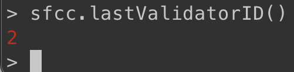

Next, try to get your validatorID from the SFC using your previously generated validator wallet address:

```javascript
sfcc.getValidatorID("{VALIDATOR_WALLET_ADDRESS}")
```

This should return **0**, as you are not registered as a validator yet:

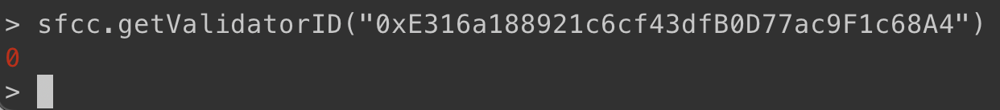

Next, unlock your validator wallet to be able to execute the registration transaction (make sure to use the password you set before). **Note that, you can perform this step (unlockAccount + createValidator) in a separate machine (different from the machine you'll run your validator node), or it'd be even more secure if you use hardware wallet to do it.**

```javascript
personal.unlockAccount("{VALIDATOR_WALLET_ADDRESS}", "{PASSWORD}", 300)
```

If everything went correct you should see a new line with only `true` on it.

Next, send the **createValidator** transaction to register your validator. Make sure to replace `123456.0` with the actual ammount of LEMX you intend to stake. Use quotes for **"0xYOUR_PUBKEY"** and **"0xYOUR_ADDRESS"**:

```javascript
tx = sfcc.createValidator("0xYOUR_PUBKEY", {from:"0xYOUR_ADDRESS", value: web3.toWei("123456.0")})
```

It will look something like this:

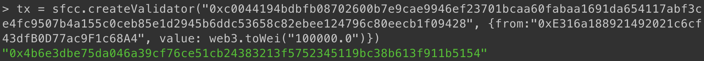

Make sure to check your registration transaction (could take a few moments to be confirmed):

```javascript
ftm.getTransactionReceipt(tx).status

```

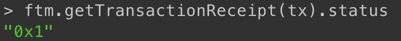

If it returns with `"0x1"`, it means the transaction was successful.

You can also copy the transactionHash and go the Lemon Explorer and check your transaction there:

`https://explorer.lemonchain.io/tx/{YOUR_TX_HASH}`

You might need to refresh the page if you cannot see your transaction.

Finally, execute the following command again to check your **validatorID**  
It should now return something other than `0`:

```javascript
sfcc.getValidatorID("{VALIDATOR_WALLET_ADDRESS}")
```

:::info

Make a note of the returned **validator id**. You will need it in the next step.

:::

Congatulations, You are now a validator for Lemon Chain!  
Close the Opera console window by typing `exit`.

## Run your Lemon Validator Node

Now that you registered your node as a new validator, you still need to restart your node in validator mode!

Make sure your node is already synced to the latest block and it is synced in `--syncmode full`.

To stop the opera process:

```shell
pkill -e opera

```

Then wait a few seconds.

Then head back to the console window where you started your node with the following command:

```shell
nohup ./opera --genesis genesis-ring.g --genesis.allowExperimental --validator.id {YOUR_VALIDATOR_ID} --validator.pubkey {YOUR_PUB_KEY} --validator.password ~/validator-key-password --db.preset=ldb-1 --syncmode full --bootnodes "enode://fb19d2f91fbc7117a8c0b45d2475bf8be06f3885c684a8ba7829769d0734144b8910b2a11da07396fc9cb0b98c9032794fd712e8a78d95bfa92106ee21ead88c@3.28.122.61:5050,enode://056e95d82d2c69d09b9a556db1362c3a49a6a866feedb4fd6f70bfc3b2197e090320860a7ca209b37004354f9093debb383f9ad816a3299c7a79258a57477e25@3.29.245.196:5050,enode://711c997c8939a76d9ff1bf7446a2d3cc485cd787a7713f89a87b6327548dd5353f6b7eaa4f15dfd229cca397814f8d82965ecdfce149a5ceb0ab8b395c6d2916@52.23.218.229:5050,enode://771f7a9b83215923516c2e09d6ff8d01c682c71c39628699025438c7fb338c67cc04896bc08cbc0b4b55a2c99305a78291d83105ef0a0c4cfab146d7e281dca2@107.20.94.68:5050,enode://263887e670352121bc5557cd242f9d891dcbaa3753c9f222f45f0ae359534b915339309fdc6815f0e55cd32f897694db1e8bcaef6d29435b95b3814b90ffcca3@15.206.189.87:5050,enode://f67d916d39cad5016cb24f3098e7d1d333077d3966b0c7f684997a28860db43267540092bbc834fd5b3084d441ac8be09f788176004d322f7430a79c33d38515@3.110.28.0:5050,enode://e2225ee07de151292c0b81057369969822143b8818b9395aa623cb1ac8711a6c91eaa6103e2e9c7dda21cc0392c295969b65a737a3b352f7c9aeb43d1d1c7b54@3.255.216.111:5050,enode://934daff86648e0ee0db297ce5251118223315cf556185d9b524bcac4adf866fad6071fa1ba0cdce834c3a31aa3f84d1fac1b40ea58f6191e7639aafcbf876d63@18.200.242.190:5050,enode://6015caf42db3c1070ba268ef38118aa1580911c4dc7a1d47625c339d2599bc68c9c027efe8a795b12c314b104b190efb46b3fee5474925d4dd440ac2e229908c@13.53.97.102:5050,enode://24d1076d04711488c52930fc4dbb05960270a94c9b6ed46272642a0dcd3405525ee4a87b279402a5267e0434683d13814b6413df40b9d69e5fbe702a7b80fdd6@13.48.29.171:5050,enode://7b296d3d2576822283f48e9a15fc5a5997b02d0475d1f018bbcabadbf1bd9e6862a21a79da62ee4314a3d626f02044b3345a74812417f13cba67fc4b71edf2a7@16.170.217.72:5050" &
```

:::warning

Make sure to replace `{YOUR_VALIDATOR_ID}` and `{YOUR_PUB_KEY}` with the appropriate values

:::

## Enable metrics for your node (optional)

Enabling metrics allows you to get some information regarding the status of your node.  
This is an optional step and can be used in combination with metric aggregators to provide a monitoring system.

To enable metrics you need to add `--metrics`, `--metrics.addr=0.0.0.0` and `--metrics.port=6060` to the command you use to start the node.

To stop the opera process:

```shell
pkill -e opera

```

Navigate to opera directory:

```shell
cd ~/go-opera/build

```

Then enter the following command:

```shell
nohup ./opera --genesis genesis-ring.g --genesis.allowExperimental --validator.id {YOUR_VALIDATOR_ID} --validator.pubkey {YOUR_PUB_KEY} --validator.password ~/validator-key-password --db.preset=ldb-1 --syncmode full --metrics --metrics.addr=0.0.0.0 --metrics.port=6060 --bootnodes "enode://fb19d2f91fbc7117a8c0b45d2475bf8be06f3885c684a8ba7829769d0734144b8910b2a11da07396fc9cb0b98c9032794fd712e8a78d95bfa92106ee21ead88c@3.28.122.61:5050,enode://056e95d82d2c69d09b9a556db1362c3a49a6a866feedb4fd6f70bfc3b2197e090320860a7ca209b37004354f9093debb383f9ad816a3299c7a79258a57477e25@3.29.245.196:5050,enode://711c997c8939a76d9ff1bf7446a2d3cc485cd787a7713f89a87b6327548dd5353f6b7eaa4f15dfd229cca397814f8d82965ecdfce149a5ceb0ab8b395c6d2916@52.23.218.229:5050,enode://771f7a9b83215923516c2e09d6ff8d01c682c71c39628699025438c7fb338c67cc04896bc08cbc0b4b55a2c99305a78291d83105ef0a0c4cfab146d7e281dca2@107.20.94.68:5050,enode://263887e670352121bc5557cd242f9d891dcbaa3753c9f222f45f0ae359534b915339309fdc6815f0e55cd32f897694db1e8bcaef6d29435b95b3814b90ffcca3@15.206.189.87:5050,enode://f67d916d39cad5016cb24f3098e7d1d333077d3966b0c7f684997a28860db43267540092bbc834fd5b3084d441ac8be09f788176004d322f7430a79c33d38515@3.110.28.0:5050,enode://e2225ee07de151292c0b81057369969822143b8818b9395aa623cb1ac8711a6c91eaa6103e2e9c7dda21cc0392c295969b65a737a3b352f7c9aeb43d1d1c7b54@3.255.216.111:5050,enode://934daff86648e0ee0db297ce5251118223315cf556185d9b524bcac4adf866fad6071fa1ba0cdce834c3a31aa3f84d1fac1b40ea58f6191e7639aafcbf876d63@18.200.242.190:5050,enode://6015caf42db3c1070ba268ef38118aa1580911c4dc7a1d47625c339d2599bc68c9c027efe8a795b12c314b104b190efb46b3fee5474925d4dd440ac2e229908c@13.53.97.102:5050,enode://24d1076d04711488c52930fc4dbb05960270a94c9b6ed46272642a0dcd3405525ee4a87b279402a5267e0434683d13814b6413df40b9d69e5fbe702a7b80fdd6@13.48.29.171:5050,enode://7b296d3d2576822283f48e9a15fc5a5997b02d0475d1f018bbcabadbf1bd9e6862a21a79da62ee4314a3d626f02044b3345a74812417f13cba67fc4b71edf2a7@16.170.217.72:5050" &
```

:::warning

Make sure to replace `{YOUR_VALIDATOR_ID}` and `{YOUR_PUB_KEY}` with the appropriate values

:::

The node is now started with metrics enabled.

To find the metrics URL enter the following command:

```shell
cat nohup.out | grep -a "Starting metrics server" | grep -Eo "http://.*$" | sed "s@//.*:@//$(curl -s -4 ifconfig.io/ip):@" | tail -n 1

```

If everything goes well, the output should be the metrics URL. It will look similar to `http://1.2.3.4:6060/debug/metrics`

:::info

Make a note of your metrics URL in case you need to connect your node with a monitoring service or to use for when you need to check the status of your node.

:::

To verify that metrics work, visit this URL in your browser.

You will see a lot of data points like this:

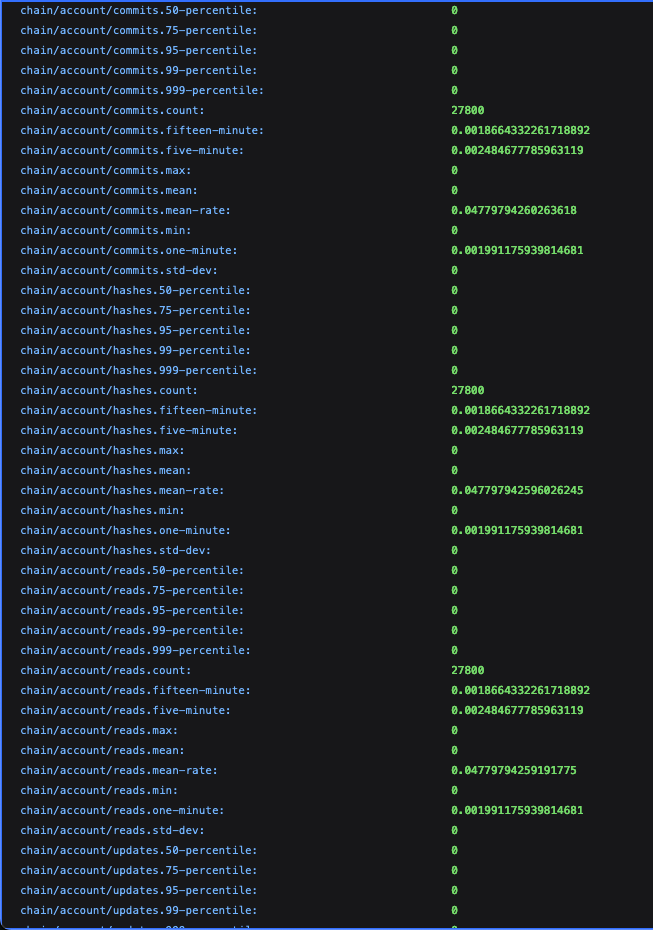
