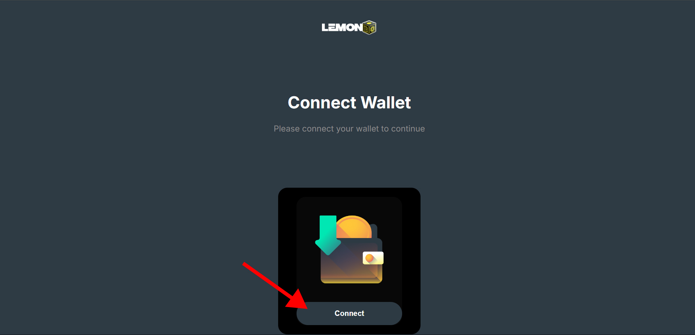
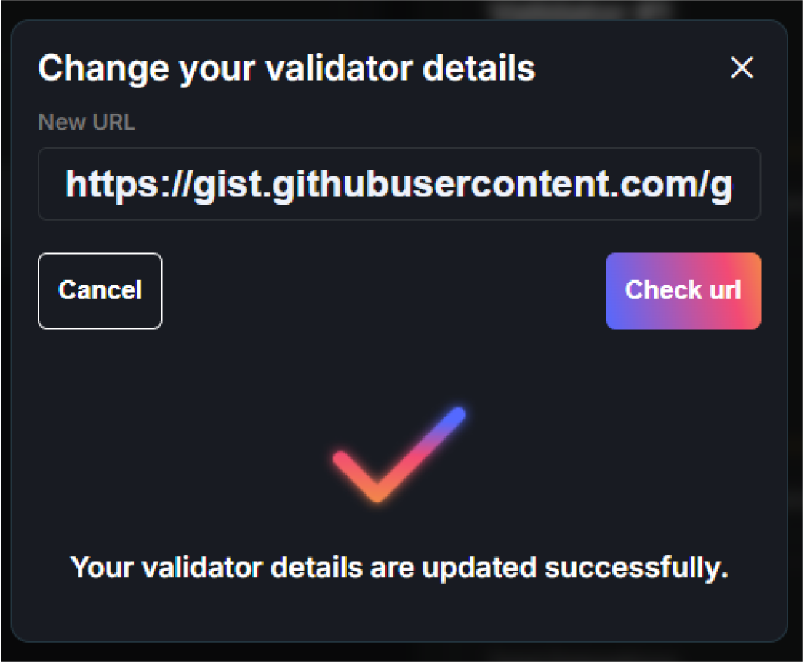

# Validator Info Update

Update your validator details.

## Parameters
All of these parameters are optional.
- Name
- Logo
- Website
- Contact

## Format

You are required to provide a link to a JSON file that includes the specified fields.
```
{
  "name": "My validator",
  "logo": "url-for-the-logo",
  "website": "https://yourURL.com",
  "contact": "contact@mail.com"
  }
```
**name** - It will be presented in the validator list.  
**logo** - Include this in the validator list as well. The preferred size is 56px by 56px, though using square dimensions is strongly recommended.  
**website** - This link will be displayed beneath your validator name.  
**contact** - It will not be displayed publicly; it is solely for internal use

We recommend using [Gist](https://gist.github.com/) to store this JSON file, but you may host it anywhere, as long as it remains accessible for external requests."

## Update

To update your validator details, you must visit the [staking website](https://stake.lemonchain.io/).

### Step 1
Connect your validator wallet to the site.

<!--  -->

### Step 2
Your validator details will be visible on the dashboard.

<!--  -->

### Step 3
Click the edit icon next to your validator name.

<!--  -->

### Step 4
After pasting the URL into the input field, you can validate your data by clicking the 'Check URL' button.

<!--  -->

:::info

If you omit any fields, the JSON object will still be considered valid, and the UI will appear as follows

:::

<!--  -->

### Step 5

Submit your updated details. As this URL will be stored on the blockchain, you will need to confirm the transaction through your wallet

<!--  -->

Following this, a success message will confirm that your validator details have been updated.
