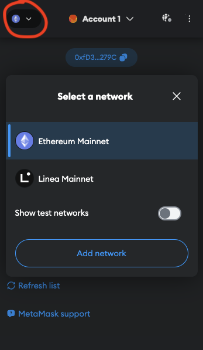
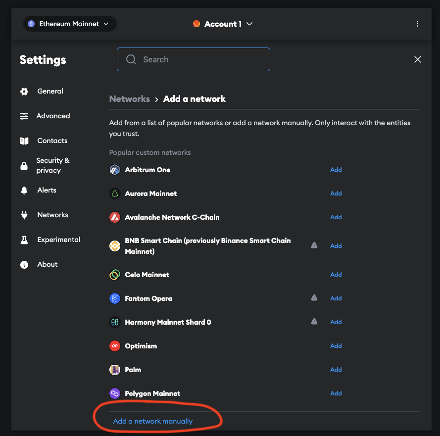
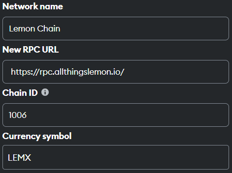
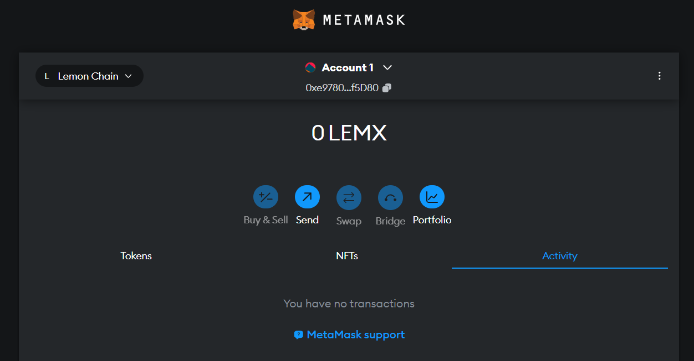

# Set up Metamask (Mainnet)

This tutorial will help you manually add Lemon Chain Mainnet to MetaMask. 

### Step 1 

Download Metamask by clicking here: https://metamask.io/ 

### Step 2

Go through the steps to create a wallet.

### Step 3

Click on the Ethereum icon, located top left of the wallet. After the window pops up, click "Add network":

### Step 4

A new tab will open. Click on "Add a network manually":

### Step 5

Fill in the following details: 

| Property           | Value                                   |
|--------------------|-----------------------------------------|
| Network name       | `Lemon Chain`                           |
| RPC URL            | `https://rpc.lemonchain.io`             |
| Chain ID           | `1006`                                  |
| Currency Symbol    | `LEMX`                                  |

This is what it should look like:

### Step 6

You are now ready to use the Lemon Chain Mainnet.

